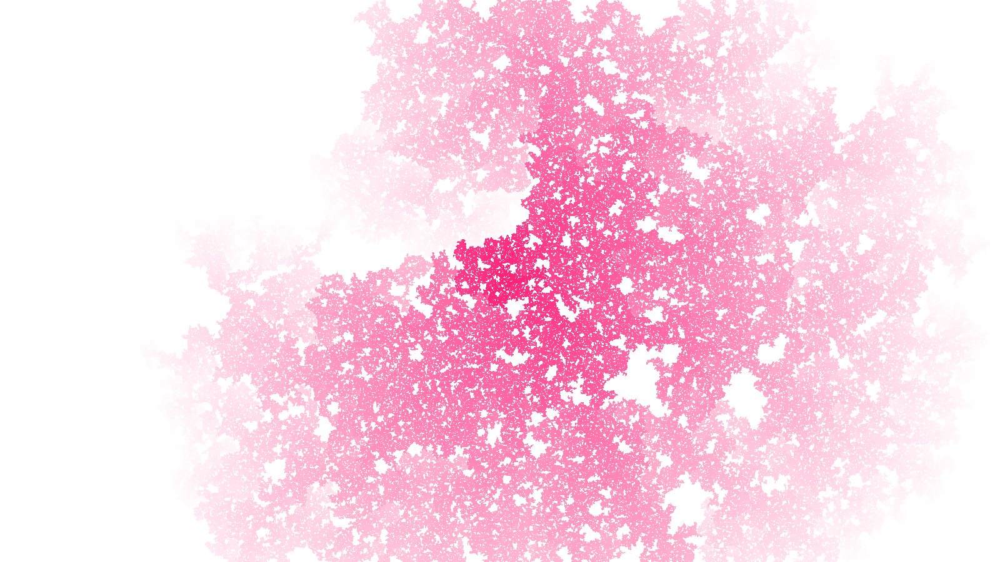
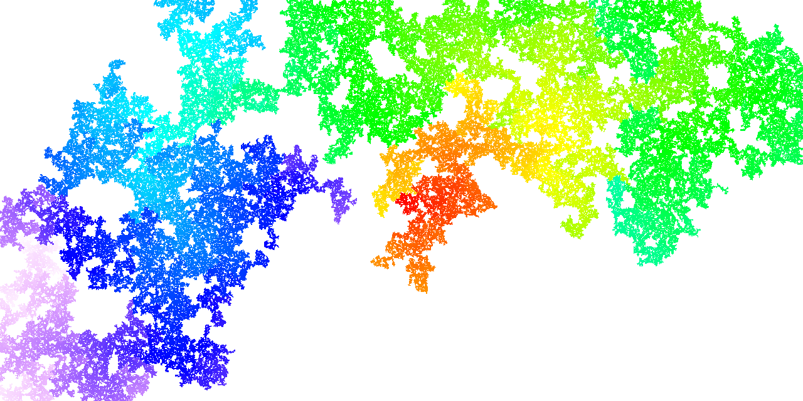
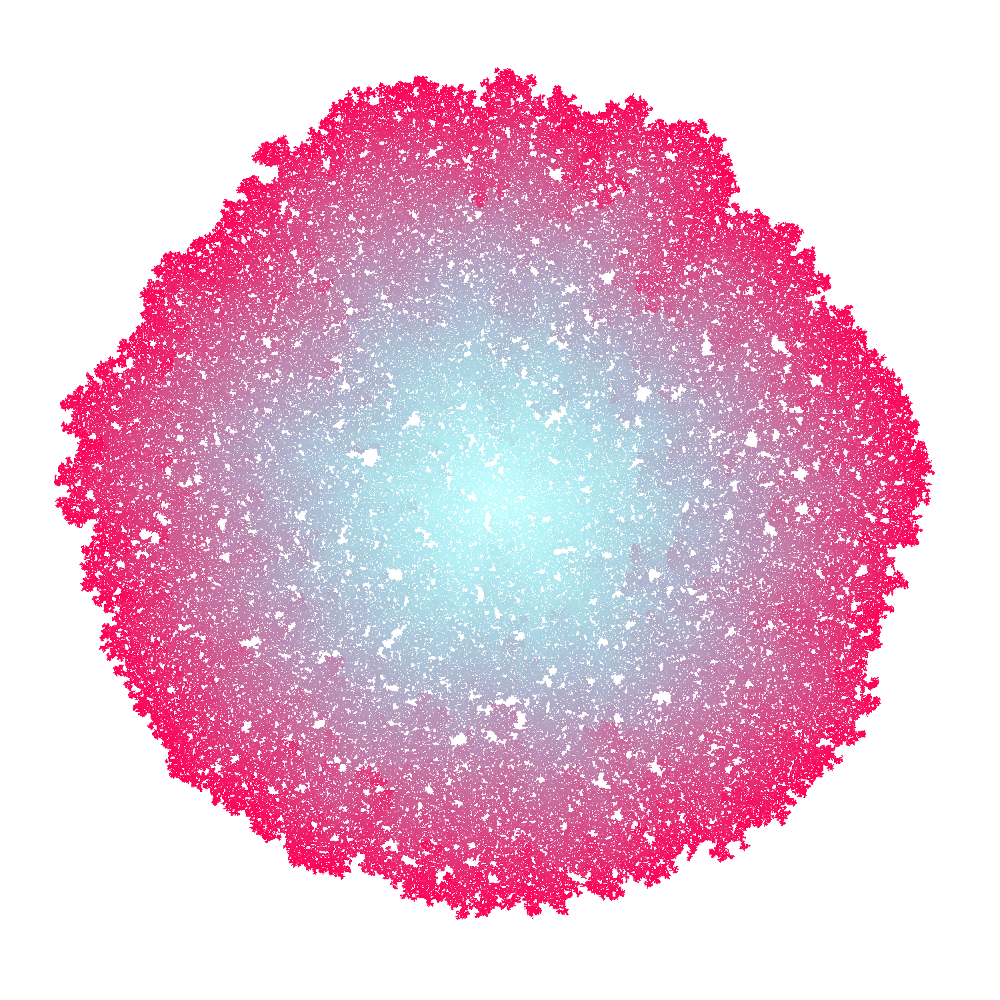
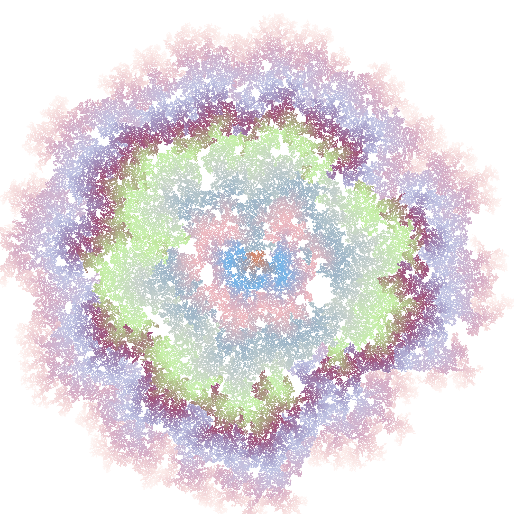
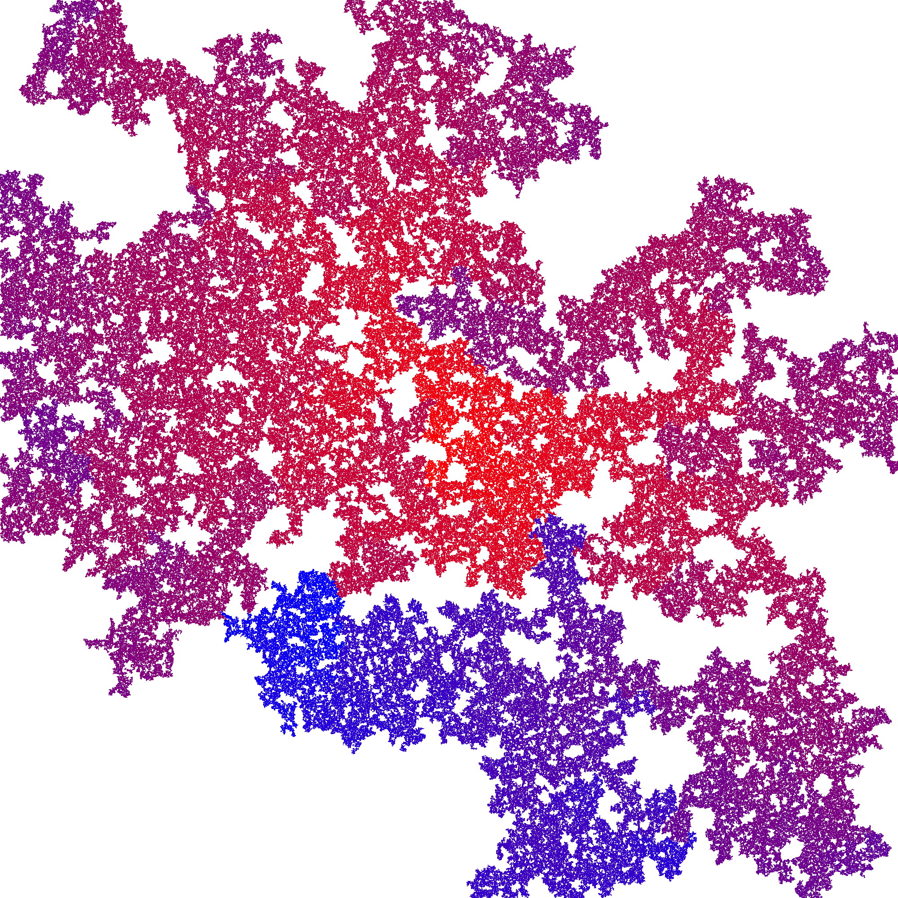
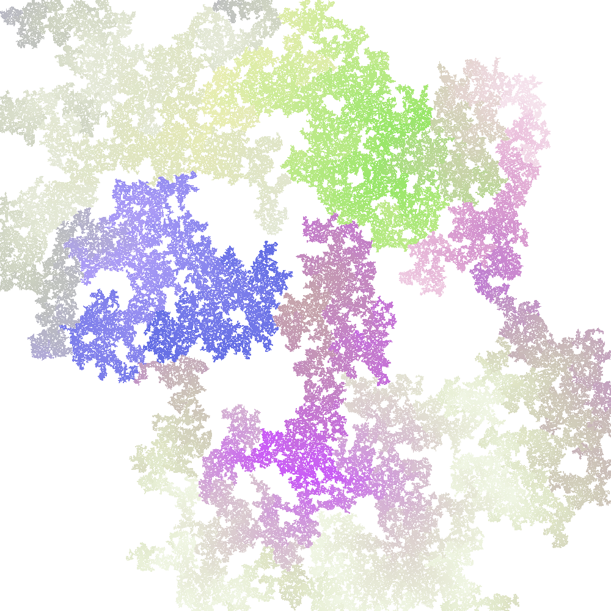
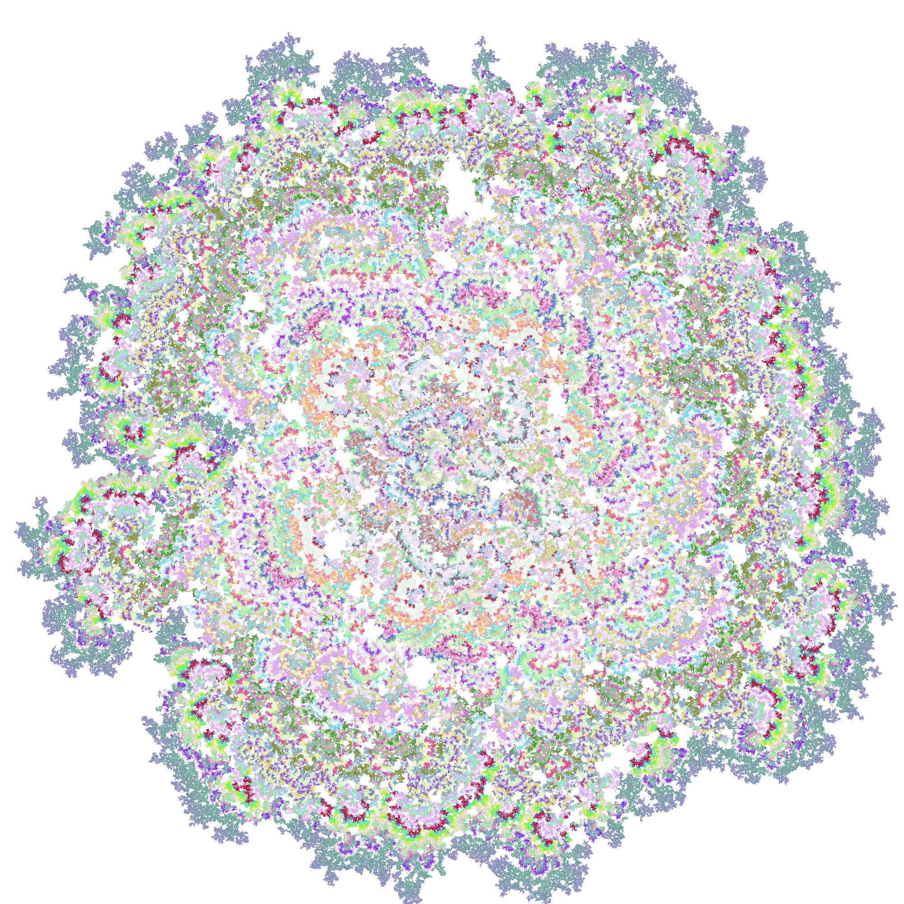

# Nebular Automata
### A program for visualizing an interesting mathematical idea
## It's a C++ version of my original project on Python called [Nebular Automata](https://github.com/8nhuman8/nebular-automata)

## Table of contents
- [My Telegram channel](#my-telegram-channel)
- [Idea](#idea)
- [Some remarks](#some-remarks)
- [Usage](#usage)
- [Credits and references](#credits-and-references)
- [License](#license)
- [Gallery](#gallery-images-created-by-this-program)

## My Telegram channel
I created a [Telegram channel](https://t.me/nebular_automata) in which the bot generates and uploads images with detailed characteristics every two hours.

## Idea
>The original idea was found [here](https://vk.com/math_dosug?w=wall-149993556_46382), and the author is this [person](https://vk.com/id504076319).

Let a square be surrounded on each side by a new square of the same size with a chance of **q**. Newly formed squares reproduce other squares and so on, to infinity.  
We will limit the growth of the population by setting a certain maximum allowable number of squares, upon reaching which the program will be completed.

As you probably noticed when looking at the images [below](#gallery-images-created-by-this-program), the edges of the shapes have a different color, into which the initial color smoothly flows. This was done not only to illustrate the process of structure development, but also for greater saturation and prettiness of images.

## Some remarks
With **q** tending to **1**, the structure becomes more and more like a *rhombus*, that is not really surprising.  
If the **q** is less than **0.5**, then the structure is *unlikely to grow*.  
If **q** approximately equal to **0.5**, the structure is *complete chaos*.  
With **q** approximately equal to **0.6**, the structure resembles a *circle*.  
If **q** is in **\[0.7, 1)**, the the structure looks like a *convex rhombus*.  
If **q** is equals to **1**, the structure becomes a *rhombus*.

In fact, we can also generate squares if we surround each square not only on each side, but also on each corner.

## Usage

## Credits and references
The original idea was found [here](https://vk.com/math_dosug?w=wall-149993556_46382), and the author is this [person](https://vk.com/id504076319).

## License
[Nebular Automata C++](https://github.com/8nhuman8/nebular-automata-cpp) specific code is distributed under [MIT License](https://github.com/8nhuman8/nebular-automata-cpp/blob/master/LICENSE).

Copyright (c) 2020 Artyom Bezmenov

## Gallery (images created by this program)

